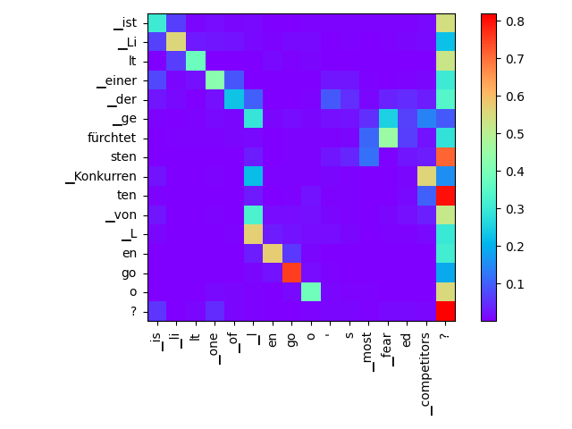
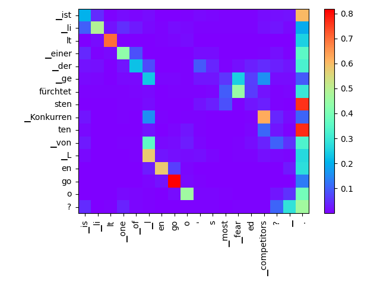
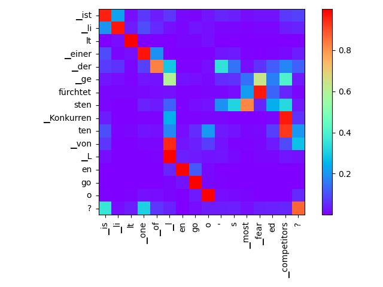
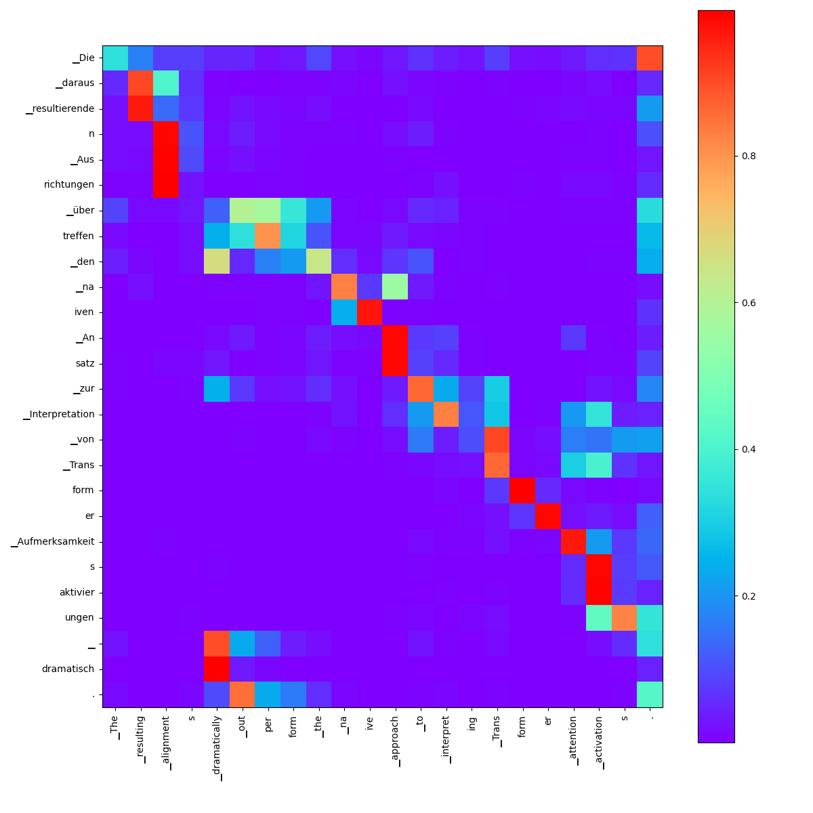
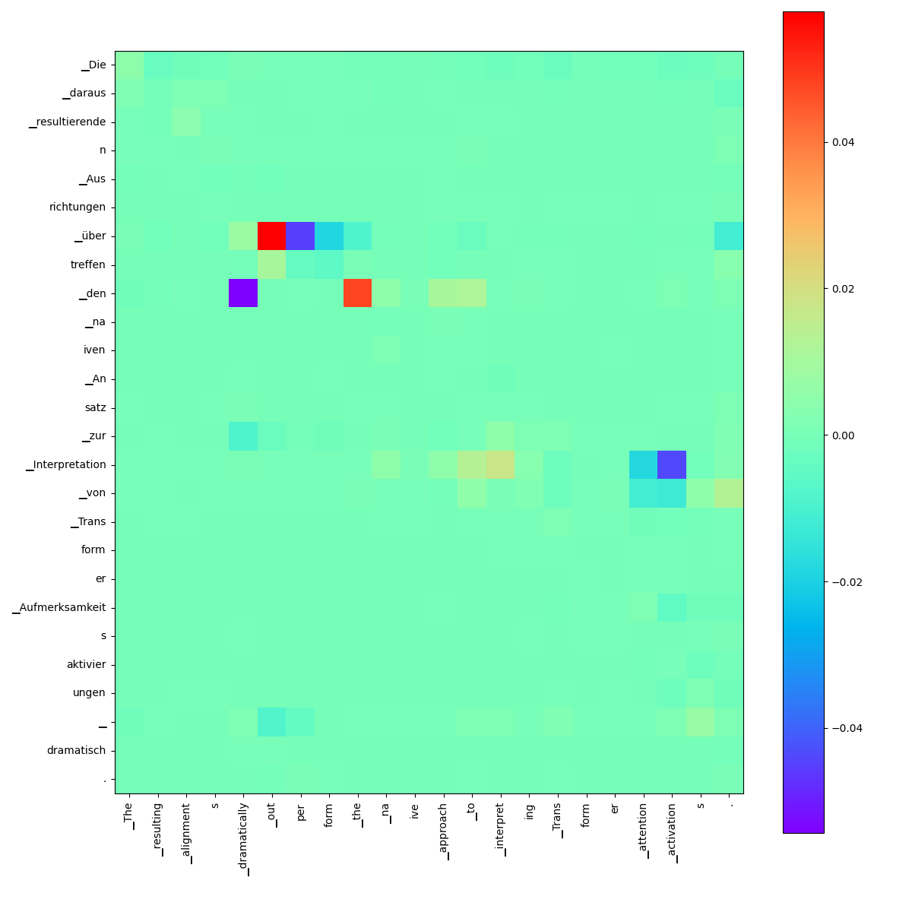
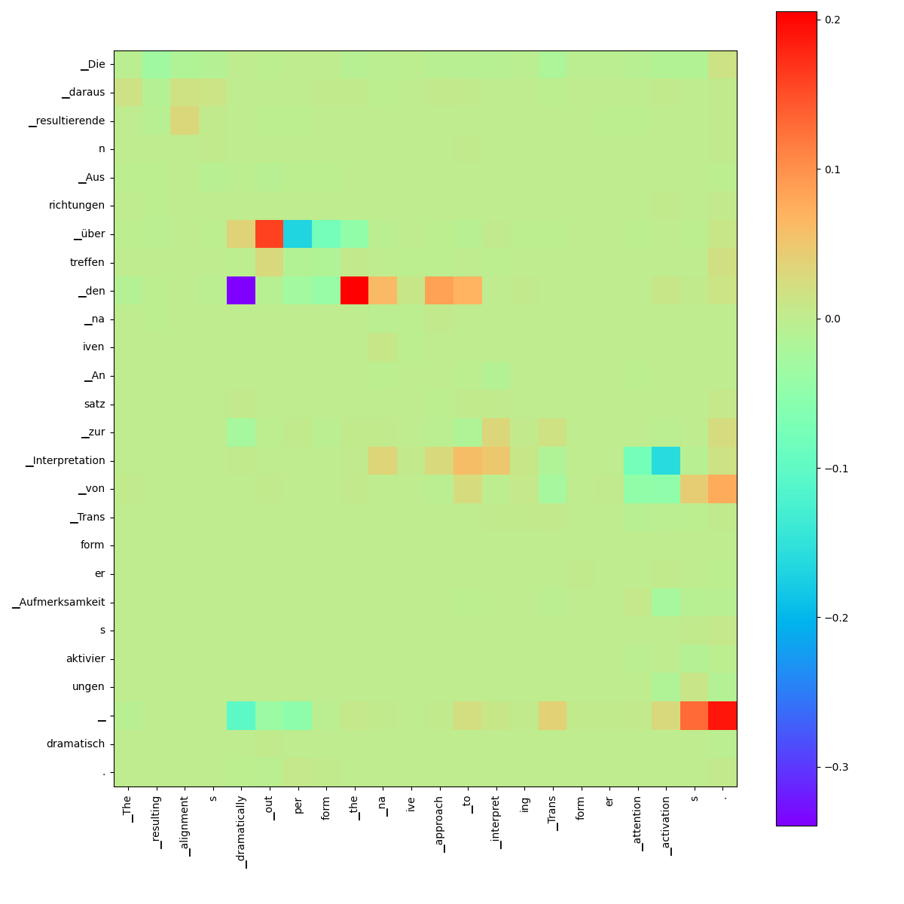

# Glossary Injection

* defining the problem as: `a certain kind of leveraging prior-knowledge + constraining MT-model` see [word/phrase-constraints](https://github.com/THUNLP-MT/MT-Reading-List#word_phrase_constraints)
* choosing the `naive word alignment` approach: seems to be straight forward

## issues,limitations, thoughts:
* word-inflections? -> "correct" inflection-errors with LevT ?
    * note the wrong inflection in the injected phrase `am meisten gehasst` (missing an `en`, here depending on the sex of `Konkurrent`)

* glossary-dictionary can be unsufficient for ambiguous words (where surface-form can carry multiple semantic meaning depending on context like `UNO`)
    * problem partly alleviated by using regex-matches instead of pure string-match
    * ambiguities could be tackled by use of sequence-tagging (spacy-NER) or some lookahead/behind regexes

* short-comings of the naive-alignment approach
    * there are some serious doubts that attention sufficiently correlates to alignment
      -> __Brunner2020__ shows that that the assumption that encoding-i corresponds to token-i is to be taken with caution
        * the deeper the layer the more depletes the influence of token of index `i` to encoding of same index (less than 50% after first layer) 

* OpenNMT has super low code-quality! was a pain-in-the-head refactoring!
* simple subword-token alignment does not guarantee consistent+meaningful target-sequences!
    -> maybe some outlier-detection + low-passfiltering (gap-filling) necessary

## naive word alignment approach [using OpenNMT](opennmt_lexicon_injection.py)
0. have a glossary/terminology-mapping 
    * `key` -> `regex pattern`
    * `value` -> `to-be-injected string`
    * example: 
    ```python
    phrase_mapping = {
        r"(?:(?:L|l)ilt|LILT)": "TheOneWhoMustNotBeNamed",
        r"most feared": "am meisten gehasst",
    }
    ```
1. find span-matches in source-string
    * source-string: `is lilt one of lengoo's most feared competitors?`
    * span-matches: `[(2, 3), (12, 14)]`, note that at char-position `2` there is a space, which is part to the `'▁li'` subword
2. use cross-attention-matrix for alignment 
    * cross-attention == [context-attention](https://github.com/OpenNMT/OpenNMT-py/blob/592a2f62f098c69beeb5487f93d6c74321363630/onmt/decoders/transformer.py#L66))
    * OpenNMT output [head-averaged attention](https://github.com/OpenNMT/OpenNMT-py/blob/592a2f62f098c69beeb5487f93d6c74321363630/onmt/decoders/transformer.py#L107) over all decoder-heads in 4th decoder-layer
        * I suppose this default to 4th layer is an opinionated heuristic from OpenNMT-developers
        * [attentions for all layers](attention_all_layers.md) -> others look also not that bad!
    
    * many-to-many alignment via __maximum over column and rows__ -> this differs from [OpenNMT's approach](https://github.com/OpenNMT/OpenNMT-py/blob/bb2d045f866a40557c3753b0a1be1bcb7fd1866e/onmt/utils/alignment.py#L77)
    * maximizing over columns (OpenNMT-approach) answers the question: `to which src-token is the model giving most attention with respect to tgt-token`
    * maximizing over rows answer question: `which tgt-token gives most attention to the considered src-token? -> where does src-token get "mapped" to?`
     TODO(tilo): maximizing over differently normalized scores is actually bad practice -> probably need for scores before softmax?

4. use alignments to find target-subwordtoken-span
    * defined by min/max of mapped target-tokens -> this is super dangerous, can completely messup the entire string!
    ```shell script
    ▁is---['▁ist']
    ▁li---['▁li']
    lt---['lt']
    ▁one---['▁einer']
    ▁of---['▁der']
    ▁l---['▁L', '▁von']
    en---['en']
    go---['go']
    o---['o']
    '---['▁der']
    s---['sten']
    ▁most---['sten']
    ▁fear---['fürchtet', '▁ge']
    ed---['sten']
    ▁competitors---['▁Konkurren', 'ten']
    ?---['?']
    ```
5. injecting terminology:
    * `ist TheOneWhoMustNotBeNamed einer der am meisten gehasst Mitstreiter von Lengoo?`    
    * capitalizing the `is` in the source leads to:`Ist TheOneWhoMustNotBeNamed einer der am meisten gehasststen Mitstreiter von Lengoo?` -> note how this minor change messes up the alignment!

## proposal for improved approach

### "enhancing" the attention-matrix
* inserting a dot at the very right that serves as a __parking position__

* renormalized without parking position


### [query optimization](opennmt_query_optimization.py)
* somewhat similar to Zenkel2019's idea but no alignment-layer on top of Transformer, 
instead very same architecture
* the decoder produces at each layer an encoding that is used in the attention-mechanism as a `query`,
* the encoder's encoding (called [memory_bank](https://github.com/OpenNMT/OpenNMT-py/blob/bb2d045f866a40557c3753b0a1be1bcb7fd1866e/onmt/decoders/transformer.py#L165) in OpenNMT-TransformerDecoderLayer) serves as `key` and `value`
* in a normal setting these parameters are being calculated during forward-pass, their values depending on the encoder- or decoder-input
* here we decouple the `query`-variable from the computation graph an treat it like a "parameter" (learnable weight-matrix)

__step-by-step__:  

1. initialize query by normal forward-pass (actually multiple passes due to beam-search)
2. patch the decoder-layer that is chosen to be use for alignment so that its query-variable becomes a learnable parameter
3. fit the query-parameter as to maximize probabilities that target-tokens are predicted
4. visualize attention-matrix-difference resulting the "optimized" queries
    
    *original attention*
    
    *difference in attentions* -> note how attention of `_über` switched from `perform` to `_out`
    and `_den` from `_dramatically` to `_the` 
    
    *difference in attentions learning-rate = 10.0*  -> might be degenerating, makes no sense, that the space is giving more attention to the dot (lower part of matrix)
    
* pros: 
    * seems to produce at least some meaningful attention-shifts

* cons:
    * alignment-layer (4th one) is still chosen arbitrarily
    * how many optimization-steps at what learn-rate? currently 100 steps -> takes 5 seconds for this phrase! 
 
    
## SOTA (reading papers)

### 1. word alignment
##### naive approach
* Zenkel2019: `this procedure is not the best approach, as it does not encourage the soft attentions to correspond to useful alignments`

##### unsupervised:
* [Zenkel2019](https://arxiv.org/abs/1901.11359); [Zenkel2020]

##### supervised: [multi-task](https://arxiv.org/abs/1909.02074) learning (together with translation task)
* [guided alignment](https://arxiv.org/abs/1607.01628)
* [OpenNMT-alignments](https://github.com/OpenNMT/OpenNMT-py/blob/master/docs/source/FAQ.md#can-i-get-word-alignment-while-translating)
* marian-nmt: `train the chosen attention head to be more similar to word alignment by providing moses-style word alignment during training with --guided-alignment path/to/alignments. The alignments need to correspond linewise to your training data.`-> shit this is supervised! [see](https://github.com/marian-nmt/marian-dev/issues/277)
* [marian](https://marian-nmt.github.io/docs/#attention-output): `Word alignments from Transformer: The transformer has basically 6x8 different alignment matrices, and in theory none of these has to be very useful for word alignment purposes. We recommend training model with guided alignments first (--guided-alignment) so that the model can learn word alignments in one of its heads.`

##### attribution methods
* [Hao2020](https://arxiv.org/pdf/2004.11207.pdf)
* gradient based attribution methods: [Brunner2020](https://www.arxiv-vanity.com/papers/1908.04211/)

### 2. retraining/finetuning
1. `placeholder-mechanism`, 
2. `code-mixed training`: [Dinu2019]
    * `do not reliably guarantee the presence of the constraints at test time`
    
### 3. constrained decoding
* `significantly higher computational overheads`
* grid beam search (GBS)
* [dynamic beam allocation (DBA)](https://arxiv.org/abs/1804.06609)
    * [issue](https://github.com/marian-nmt/marian/issues/204)
    * quite interesting + no idea how it works, but seems only to support inclusive/exclusive constraints so no purposefully substitutions -> could be that for "real-world application" this makes no difference  

### 4. target-phrases as "seeds" for non-auto-regressive MT
* confronting LevTransformer with preinserted targets-phrases, see [Susanto2020]

## papers (no need to read, just notes)
* [literature](https://github.com/THUNLP-MT/MT-Reading-List)
* [Zenkel2019](https://arxiv.org/abs/1901.11359)
    * `trained on bilingual data without word-alignment information.`
    * `alignment inference procedure which applies stochastic gradient descent to directly optimize the attention activations towards a given target word`
    * `This work extends the Transformer architecture with a separate alignment layer on top of the decoder sub-network. It does not contain skip connections around the encoder-attention module, so
        that it is trained to predict the next target word based on a linear combination of the encoder information.`
    * `On the French-English task our method improves the alignment quality by a factor of three over the na¨ıve baseline`
    * alignments-layer consists of single attention head without skip-connections; last decoder-hidden as query
    * attention optimization during inference
        * `objective of maximizing the probability of the target word ei with respect to A`
        * attentions treated as weight-matrix, `During optimization we relax the constraint for A to be a valid probability`
        * initialized attention-"weights" with those form the forward-pass
        * `applying three gradient descent steps with a learning rate of 1`
    
* [Dinu2019](https://github.com/mtresearcher/terminology_dataset)
    * learning a copy behaviour of terminology at training time
    * `the NMT model is trained to learn how to use terminology
    entries when they are provided as additional input to the source sentence`
    * `source factors`: additional features/labels; here: `factors indicating source words (0), source terms (1), and target terms (2)`
* [Susanto2020]
    * ` incorporating lexical constraints in neural machine translation.`
    * `Levenshtein Transformer (LevT) (Gu et al., 2019), an edit-based
    generation model that performs deletion and insertion operations during inference iteratively.`
    * `Non-autoregressive neural machine translation (NAT) (Gu et al., 2018) attempts to move away
    from the conventional autoregressive decoding.`
    * I'm not really convinced by this constraining approach: 
        1. in what order to insert the target phrases!? totally arbitrary!
        2. I suppose this approach only works with semantically similar `phrases` otherwise it would mess up the target-semantics!
        -> decoder has to "eat" these target-substitutions and might get heavily confused!
* [Brunner2020](https://www.arxiv-vanity.com/papers/1908.04211/)
    * `We investigate to what extent the implicit assumption made in many recent papers - that hidden embeddings at all layers still correspond to the underlying words - is justified.`
    * `We quantify how much embeddings are mixed based on a gradient based attribution method and find that already after the first layer less than 50% of the embedding is attributed to the underlying word`
    * `interpretations should be drawn carefully and should be backed up by attribution methods`

## code-bases 
* [sockeye](https://github.com/awslabs/sockeye)
* [fairseq-NAT](https://github.com/pytorch/fairseq/tree/master/fairseq/models/nat)
* [OpenNMT](https://github.com/OpenNMT/OpenNMT-py)
* [M4t1ss](https://github.com/M4t1ss/SoftAlignments)
* [lilt](https://github.com/lilt) -> is this lengoos most dangerous competitor?

## OpenNMT
* `git clone https://github.com/OpenNMT/OpenNMT-py.git && cd OpenNMT-py`
1. get model: `wget https://s3.amazonaws.com/opennmt-models/transformer-ende-wmt-pyOnmt.tar.gz && tar xvzf transformer-ende-wmt-pyOnmt.tar.gz`
2. `onmt_translate -model averaged-10-epoch.pt -src data/src-test.txt -output pred.txt -replace_unk -verbose`
    -> seems not be be using the sentencepiece.model! looks like a bug to me!